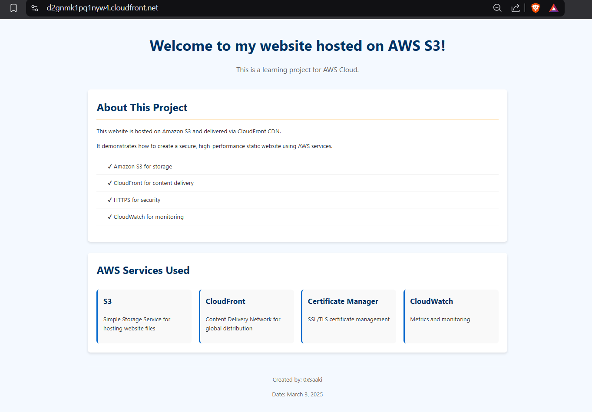

# AWS S3 Static Website with CloudFront CDN

This project demonstrates how to host a static website using AWS S3 and CloudFront, implementing best practices for security, performance, and reliability.

## Architecture


The project uses the following AWS services:
- **Amazon S3**: Hosts the static website files
- **Amazon CloudFront**: Provides CDN capabilities and HTTPS
- **AWS Certificate Manager**: Manages the SSL/TLS certificate
- **Amazon CloudWatch**: Monitors performance metrics

## Live Demo

- CloudFront URL (HTTPS): [https://d2gnmk1pq1nyw4.cloudfront.net/](https://d2gnmk1pq1nyw4.cloudfront.net/)
- S3 Website URL (HTTP): [http://bucket1static1.s3-website.eu-north-1.amazonaws.com/](http://bucket1static1.s3-website.eu-north-1.amazonaws.com/)

## Features

- ✅ Secure content delivery with HTTPS
- ✅ Global content distribution via CloudFront
- ✅ Web Application Firewall (WAF) protection
- ✅ Performance monitoring with CloudWatch
- ✅ Automatic cache invalidation

## Implementation Steps

### 1. Create an S3 Bucket
- Create a bucket with a unique name
- Configure it for static website hosting
- Upload website files (HTML, CSS, JS)
- Set appropriate bucket policy for public access

### 2. Configure CloudFront Distribution
- Set S3 bucket as origin
- Configure HTTPS with AWS Certificate Manager
- Set appropriate cache behaviors
- Configure root object (index.html)

### 3. Monitoring and Maintenance
- Set up CloudFront metrics in CloudWatch
- Configure cache invalidation process
- Enable security features

## Deployment

To deploy this project yourself:

```bash
# Clone the repository
git clone https://github.com/yourusername/aws-s3-cloudfront-website.git
cd aws-s3-cloudfront-website

# Upload the files to your S3 bucket
aws s3 sync ./website s3://your-bucket-name/ --delete

# Create a CloudFront invalidation after updates
aws cloudfront create-invalidation --distribution-id YOUR_DISTRIBUTION_ID --paths "/*"
```

## Repository Structure

```
├── website/              # Website files
│   ├── index.html        # Main page
│   ├── error.html        # Error page
│   ├── styles.css        # CSS styles
│   └── script.js         # JavaScript functionality
│
├── docs/                 # Documentation
│   └── images/           # Screenshots and diagrams
│
└── README.md             # This file
```

## Screenshots

### S3 Bucket Configuration


### CloudFront Distribution


### CloudWatch Metrics


### Website


## What I Learned

- How to configure S3 for web hosting
- Setting up a CloudFront distribution with proper settings
- Implementing SSL/TLS with AWS Certificate Manager
- Monitoring CloudFront performance with CloudWatch
- Implementing proper security practices for web hosting

## Next Steps

- Add a custom domain with Route 53
- Implement CI/CD pipeline for automatic deployment
- Add more advanced CloudFront behaviors for different content types

## License

This project is licensed under the MIT License - see the LICENSE file for details.